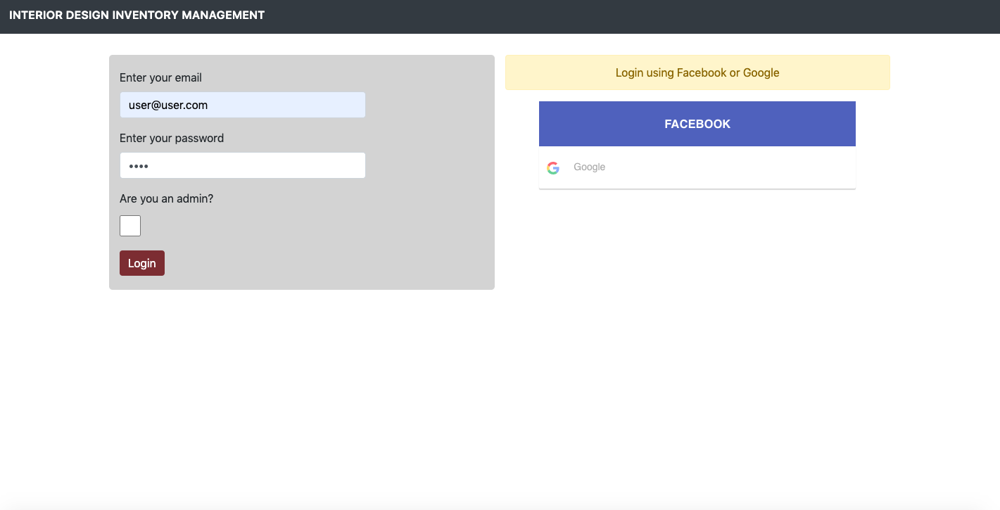
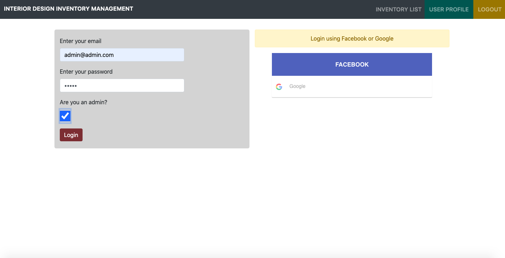
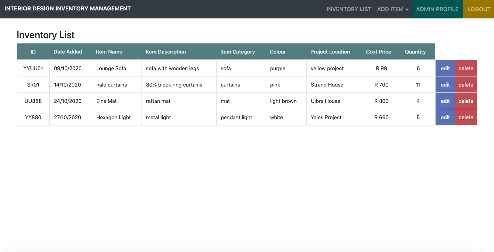
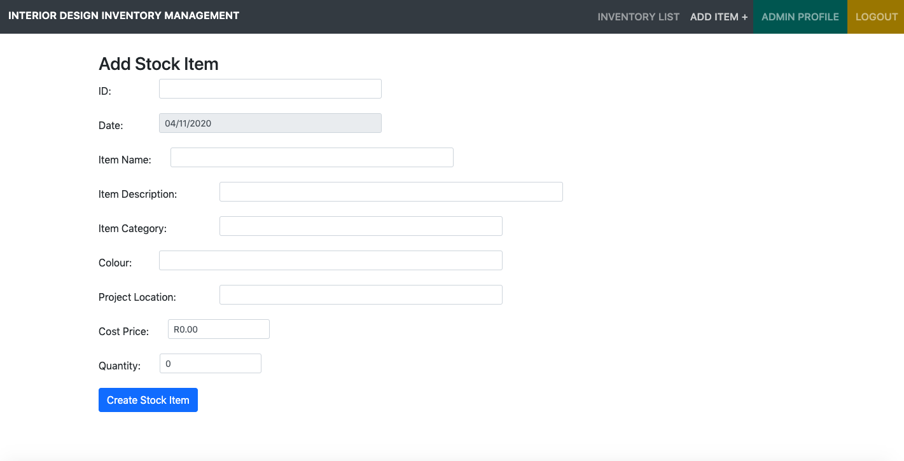
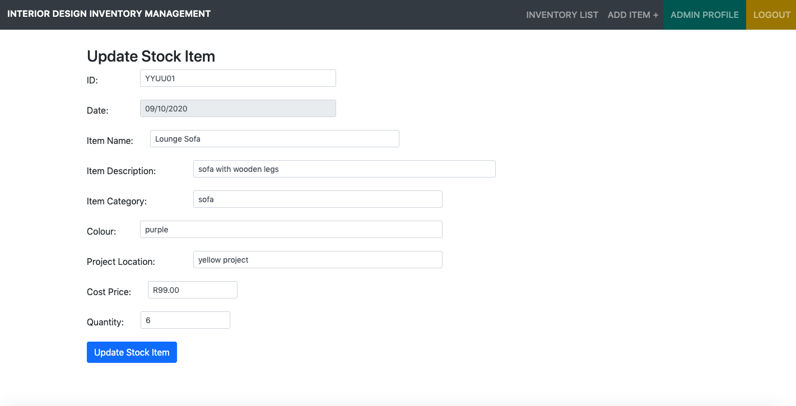
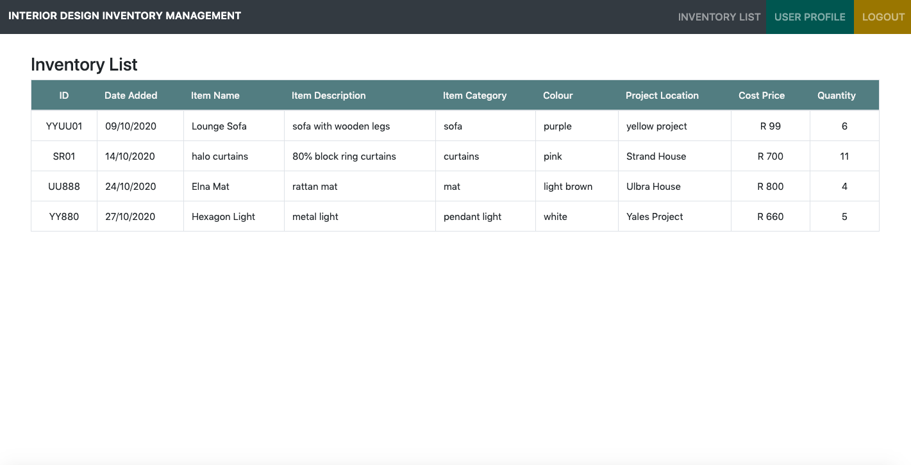

# Interior Design Inventory Management App - Fullstack (React, Node & Express)

## Introduction

Interior Design Inventory Management (IDIM) is a web application that stores all inventory items in a interior design company's warehouse to easily manage stock. IDIM will give access to users to track items that are stored in the warehouse. Admin will be allowed to track, add, update and delete items from the inventory list. A normal user will only be able to track the inventory list.

## Table of Contents
* [Introduction](#introduction)
* [System Architecture](#system-architecture)
* [System Requirements](#system-requirements)
* [Functional Requirements](#functional-requirements)
* [Non-Functional Requirements](#non-functional-requirements)
* [User Stories](#user-stories)
* [Similiar Inventory Management Softwares](#similiar-inventory-management-softwares)
* [Unique Features](#unique-features)
* [Instruction on how to use IDIM](#instruction-on-how-to-use-IDIM)
* [Installation](#installation)
* [Run full stack application](#run-full-stack-application)
* [Test](#test)
* [Security](#security)
* [Deployment](#deployment)

## System Architecture

IDIM will be using mainly Javascript to code the application and thus, will be using MERN (MongoDB, Express.js, React.js and Node.js) stack to build the application. MERN stack is the ideal approach to working with Javascript and JSON.

It will be easier and more efficient to build the client-side of IDIM using React.js as it allows to build up complex interfaces through simple Components, connect them to data on the backend server and render them on HTML. Users will use a form on IDIM to add stock to the inventory list and React.js has excellent support for forms, lists and event handling. AJAX will be used to return stock item details as AJAX returns only the required data that is being requested from the server, this method will speed up the loading time.

Express.js is a server-side framework running inside a Node.js server. The frontend of IDIM will need to make GET, POST, PUT and DELETE requests in order to track, add, update and delete items from the inventory list. When making these requests via React.js the app can easily connect to the Express.js functions as Express.js has powerful models for mapping URL's and handling HTTP requests and responses.

When the user creates a stock item via a form, the stock items details will need to be stored to a database in order to manipulate the item details as the user will be allowed to edit and delete an item stored. Using MongoDB will be easier to work with when storing data in a database as JSON documents that are created in React.js can be sent to the Express.js server and stored directly in MongoDB for manipulation. IDIM will use MongoDB Atlas in the cloud as Atlas allows auto-scaling MongoDB clusters.

Using MERN stack to build IDIM will allow JSON data to flow naturally fron the front and back end and in turn helps for faster build and simple to debug.

Bootstrap and CSS will be used to style the frontend of IDIM as bootstrap has lots of built-in features which will make for faster styling of the app. The styling features are modern which fits with IDIM's design. CSS will help to style elements across all pages on the app making the app more easy to understand and use. Iconify will be used to add icons to the app. Iconify is a icon framework that combines pixel perfect rendering of SVG. Iconify allows for easy access to a wide range of icons and makes for less coding.

Heroku will be used to deploy IDIM as it is easy to use, allows for instant scalability which is crucial for IDIM as users will need to add large amounts of stock items to the inventory list. 

## System Requirements

IDIM will be used by Interior Design companies to create and track their inventory lists. Interior Designers, Project Managers and Architects will be able to view the inventory list. The Inventory Manager will have access to the inventory list and will be able to add, update and delete stock items. Employees will benefit from IDIM as the Inventory Manager will save time on creating long excel spreadsheets to document all stock items, wasting valuabe time on updating spreadsheets and printing out a large document. The Interior Designers, Project Managers and Architects wont need to waste time on going through a large spreadsheet to find stock they need for projects. IDIM saves you time and money by creating a database that stores all stock item details on the cloud giving you access to the application anytime and anywhere no need for large excel spreadsheets. The inventory database will automatically update the inventory list when an item is updated or deleted. 

## Functional Requirements

- Set-up user and admin authentication to enable users and admin to login via Local authentication, Google and Facebook.
- Create User page where users can only track the inventory list.
- Create Admin page where admin will have access to the inventory list and will be able to add, update and edit stock items.
- Within the Admin page, create a form where admin will be able to add stock to the inventory list.
- On the Admin page, the inventory list must have a edit and delete button for each line item.
- Create database to store the stock item details.

## Non-Functional Requirements

- Logging in must be an easy process for users and admin to login to IDIM.
- Displaying the correct page when admin or user logs into IDIM as the user and admin has unique access rights.
- IDIM must display the correct stock item details and update the inventory whenever admin makes changes to the inventory list.
- IDIM must be able to hold a large number of stock items to the inventory list as Interior Design companies can store lots of stock in their warehouse and IDIM should cater for large business.
- The user interface of IDIM must be easy to understand in order for a new or existing user to easily navigate through the app.
- Use code that is clean and efficient in order to the load the app fast.
- By using Helmet security framework the inventory list for a company must be secured only allowing access to users and admin.

## User Stories

1. As Sue, I want to login to IDIM, so that I can track stock items on the inventory list and provide this information to the Head Interior Designer.
2. As Marc, I want to check what stock is availabe, so that I can see what I stock i can use for an interior design project.
3. As Terrence, I want to delete an item from the inventory list, so that I know which stock items were taken from the warehouse.

## Similiar Inventory Management Softwares
- inFLow Inventory
- Odoo
- ZhenHub

## Unique Features

- Easy to use as basic requirements of managing and tracking stock items is the focus of IDIM.
- Little training required.
- Cost effective as IDIM bills a fixed amount yearly instead of increasing the price as more users join within a company.
- Modern approach to the UI.

## Instruction on how to use IDIM

The app is based on user access control. A normal user is limited to only viewing the inventory list and an admin is able to view the inventory list, create a stock item and update or delete a stock item from the inventory list.

### Landing Page
The landing page displays the login form.

### User Login
To login as a normal user just add a username and password of your choice or login via your Facebook or Google account.

### Admin Login
To login as an admin type in your username and password and select the admin checkbox.

### Admin Access
If you are authenticated as admin you will be redirected to the admin inventory list where you can view all the stock items and edit or delete a stock item. You are also able to access the add stock item form.

### User Access
If you authenticated as a user you will only have access to view the inventory list

## Installation

Server-side installation:

Navigate to InventoryManagementApp folder from your terminal and type in NPM install to install node_modules.

Client-side installation:

Navigate to client folder within the InventoryManagementApp folder and type in NPM install to install node_modules for front end.

Add your own MongoDB URI in the db.js file.

Add your own Google and Facebook clientID and clientSecret by navigating to config folder and add these credentials in the user.config file.

## Run full stack application

Run the server & client concurrently

Navigate to cd InventoryManagementApp and type NPM start

Add a new terminal and navigate to cd client, type in NPM start

Server and client runs on [http://localhost:3000](http://localhost:3000)

## Test

### Snapshot test:

cd into the client folder and run the command npm test

### Unit test:

Navigate to root directory (InventoryManagementApp) and run the command npm test

## Security

This app is secured with Helmet for security purposes. Users passwords is stored in the database with bcrypt. 
The API keys for Google, Facebook, JWT secret and MongoDB are stored in a keys file, this keys file will be used in development, however when IDIM is in production, Heroku will use the environment variables that i have stored in prod file. End users will need to add their own API keys to the config file. The end user will need to add their own API keys for the app to work correctly

## Deployment

IDIM is deployed on Heroku. The backend and front end will be deployed together. Deploying IDIM this way will be cost effective and quite frankly, easier to deploy as the app will share one server.

